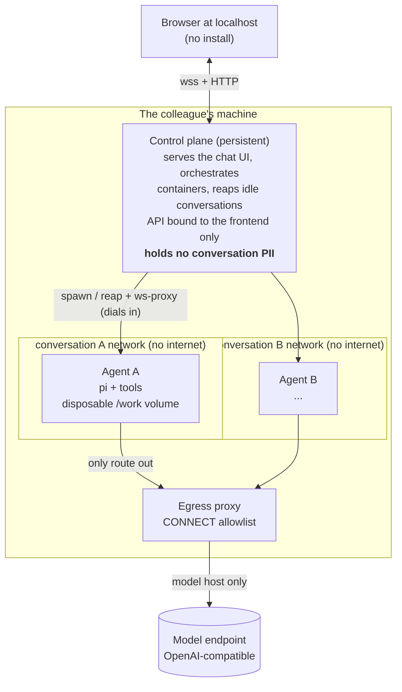

# hakanai

儚い (*fleeting*). A private, **provably-deletable** AI chat appliance for non-technical colleagues. Each conversation is one sealed, egress-locked container plus one disposable volume: delete it and the data is gone.

A fork-in-spirit of hako (a dev agent harness): the same capable agent, the opposite invariants.

> Status: working prototype. End-to-end chat, document and media tools, image understanding, file upload and download, and per-conversation history all run against a configurable OpenAI-compatible model, with agents fully egress-locked.

## What it guarantees

- **Provable deletion.** The deletion boundary is the container plus its disposable volume; destroy them and the bytes are gone.
- **No exfiltration path.** Agents sit on a no-internet network; a CONNECT-allowlist proxy reaching only the model host is their sole route out, even under prompt injection.
- **Cross-conversation isolation.** Each conversation is its own container on its own network; one conversation's data cannot reach another.
- **Single-user, on their own machine.** Each person runs their own instance; PII never centralizes.

The full threat model, how each guarantee is enforced, what is out of scope, and how to verify the claims are in [SECURITY.md](SECURITY.md). Design decisions are recorded in [docs/adr/](docs/adr/).

## Why not just hako

hako bind-mounts a live home, gates writes with per-call approval, and updates via `git pull`. hakanai inverts all of it: no bind-mount, a baked immutable image, a read-only outward surface, and a disposable volume reaped after 3 days idle. Those invariants are hard-coded here rather than toggled.

## Architecture



Each conversation is a fresh container running `pi` (the agent) wrapped to a websocket, on **its own isolated network**; the browser talks to it through the control plane. The control plane dials agents but binds its own API to the frontend interface only, so a sandboxed agent can reach neither the control-plane API nor another conversation's agent (`scripts/isolation-smoke.sh`). Orchestrating a fresh isolated container per conversation is the part this builds.

## What the agent can do

A capable everyday assistant, not a dev box. It reads and writes Word, Excel, and PowerPoint, handles PDFs, and sees images directly; it converts documents with pandoc, OCRs with tesseract, and handles audio and video with ffmpeg. Files you attach are written into its container; files it produces come back as download links. Conversations are auto-named, and history is restored on reload.

## Run it

```sh
./hakanai          # build images + start at http://127.0.0.1:8800
./hakanai down     # tear it all down
./hakanai smoke    # creds-free checks (egress, ACP, isolation, memory budget)
```

`up` opens the UI: Chromium in app mode if available, otherwise your default browser (`HAKANAI_NO_BROWSER=1` to skip). `./hakanai help` lists everything.

### Model

Any OpenAI-compatible endpoint, configured by a gitignored `.env` next to `compose.yaml`:

```sh
HAKANAI_MODEL_BASE_URL=https://inference.example/v1
HAKANAI_MODEL_API_KEY=...        # bearer token
HAKANAI_MODEL=default            # a model id the endpoint serves
```

The control plane injects these per agent and adds the endpoint's host to the egress allowlist; it is the only host an agent may reach. No credentials are baked into any image.

### Resource budget

The footprint scales with how many conversations run at once. At most `HAKANAI_MAX_ACTIVE` agent containers run together (default 2); opening another stops the least-recently-used idle one (its conversation is kept and resumes on return). Each agent is capped with `HAKANAI_AGENT_MEMORY` (default `4g`, a generous backstop), `HAKANAI_AGENT_PIDS` (default `512`), and `HAKANAI_AGENT_CPUS` (default `2`). See [SECURITY.md](SECURITY.md) and [ADR-0002](docs/adr/0002-memory-budget.md).

## Layout

- `control-plane/` -- Bun server: the chat UI (React + assistant-ui), conversation REST, the browser-to-container ws proxy, the idle reaper, and docker orchestration.
- `agent/` -- the baked, immutable agent image: `pi` plus the document and media toolkit, writing only to `/work`.
- `egress-proxy/` -- the CONNECT-allowlist chokepoint (the agents' only route out).
- `hakanai` -- the one-command runner. `scripts/` -- creds-free smoke checks.

## Remaining seams

- Pin base images and npm/apk versions by digest, bump via Renovate.
- Make the idle-deletion clock durable (it currently lives in control-plane memory, so a restart resets it).
- A `/work` disk-size cap (memory, pids, and cpu are capped; disk is not, as docker cannot enforce volume size portably).
- Auto-derive the concurrency cap and per-agent limits from total RAM, instead of fixed defaults.
